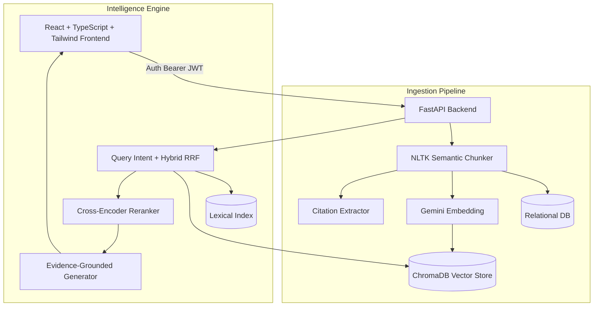

# LEXORA
## AI-Powered Legal Intelligence & Research Platform

A world-class, production-ready AI Legal Intelligence Platform engineered for Commercial Courts and Government Digital Platforms. Lexora transforms raw legal documents into deeply structured, actionable intelligence.

## 🚀 Core Features

- **Hybrid Reciprocal Rank Fusion (RRF) Retrieval**: Fuses dense vector embeddings (ChromaDB) with lexical BM25 algorithms, guaranteeing that exact statutory references and semantic legal concepts are both surfaced with high precision.
- **Cross-Encoder Reranking**: Re-ranks the fused retrieval results through a dedicated Cross-Encoder model, pruning false positives before generating the final prompt context.
- **Evidence-Grounded RAG**: Employs constrained LLM schemas to strictly map every generated claim to a `[Source X]`, drastically reducing AI hallucinations in critical legal workflows.
- **Automated Citation Intelligence**: Extracts and classifies citation networks using Regex + LLMs, automatically categorizing relationships as `FOLLOWS`, `DISTINGUISHES`, or `OVERRULES`.
- **Lexora AI Evaluation Framework**: An offline adversarial evaluation suite that systematically tests Retrieval metrics (Recall@K, MRR) and RAG generation against prompt injection, date hallucination, and missing evidence.
- **Unified Legal Research Workspace**: A persistent, stateful research environment allowing users to save cases, capture Factual and Procedural evidence, take notes, and compare authorities within a single session.
- **Enterprise-Grade Security**: JWT-based Authentication, Role-Based Access Control (RBAC), strict Research Session isolation, and an integrated Audit Logging framework to track security-relevant actions.
- **AI Research Brief Generation**: Automatically synthesizes saved research sessions into structured, Markdown-based Research Briefs, heavily grounded with direct citations to the extracted context (e.g. `[Case A - p. 12]`).
- **Legal Timeline & Procedural History Engine**: Automatically constructs interactive chronological timelines strictly separating Factual background events from Procedural history, carefully preserving approximate dates without hallucination.
- **Citation Intelligence & Precedent Graph**: Automatically extracts incoming and outgoing citations from judgments, mapping specific relationships (`FOLLOWS`, `DISTINGUISHES`, `CITES`) complete with the exact supporting passage as evidence.
- **Interactive Network Visualization**: A custom-built dependency-free interactive SVG Graph allowing researchers to instantly traverse Precedent Authority Networks and drill down into the extracted evidence of legal conflicts.
- **Multi-Case Comparative Intelligence**: Select 2 to 5 cases and perform an evidence-grounded comparative analysis. The AI matrix normalizes legal concepts across cases, systematically compares Facts, Issues, Arguments, and Principles, and strictly detects Potential Tensions without hallucinating conflict.
- **Case Intelligence Engine**: Automatically parses 100-page judgments to extract core Facts, Procedural History, Issues, Reasoning, Decisions, and discrete Legal Principles.
- **Advanced Frontend Visualizations**: Features a dynamic React workspace with Framer Motion animations, an interactive SVG Precedent Citation Graph, and a chronological Procedural Timeline.
- **Enterprise Security**: Enforces rigorous OAuth2 JWT authentication and bcrypt password hashing across the entire FastAPI stack.

## 🏗️ Architecture

### Hybrid Search Architecture

```text
Query
 ↓
Semantic Retrieval + BM25
 ↓
Fusion
 ↓
Reranking
 ↓
Research Relevance
```
### Evidence-Grounded RAG Architecture

```text
Query
 ↓
Hybrid Retrieval
 ↓
Reranking
 ↓
Context Construction
 ↓
Gemini
 ↓
Evidence Verification
 ↓
Citations
```

**Limitations**: 
- The system heavily relies on retrieving the correct chunks. If the Hybrid Retrieval engine misses the relevant authority, the system will accurately report "Insufficient evidence" rather than attempt to guess the answer.
- Evidence Verification guarantees that the citation exists in the context window, but the system may still occasionally misinterpret the legal significance of the text if it is highly ambiguous.



## 🛠️ Tech Stack
- **Frontend**: React 19, TypeScript, Vite, Tailwind CSS, Framer Motion, Lucide React
- **Backend**: Python, FastAPI, SQLAlchemy
- **Database**: SQLite (Relational Metadata), ChromaDB (Vector Search)
- **AI/ML**: Google Gemini 1.5 (Generation & Embedding), NLTK (Semantic Chunking), Cross-Encoder (Reranking)
- **Security**: python-jose (JWT), passlib (bcrypt)

## 📦 Local Setup Instructions

### 1. Clone & Configure
```bash
git clone https://github.com/NITISH1817/LEXORA-AI-Powered-Legal-Research-Platform.git
cd LEXORA-AI-Powered-Legal-Research-Platform
```

### 2. Backend Setup
```bash
cd backend
python -m venv venv
source venv/bin/activate  # Or `venv\Scripts\activate` on Windows
pip install -r requirements.txt
```

Create a `.env` file in the `backend/` directory (see `.env.example` for details):
```env
GEMINI_API_KEY=your_key_here
SECRET_KEY=your_secure_random_string
```

Run the API:
```bash
uvicorn app:app --reload --port 8000
```

### 3. Frontend Setup
```bash
cd frontend
npm install
npm run dev
```

Navigate to `http://localhost:5173`. You must register an account and login to access the workspace.